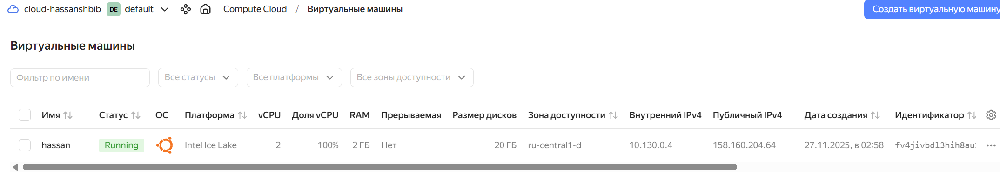
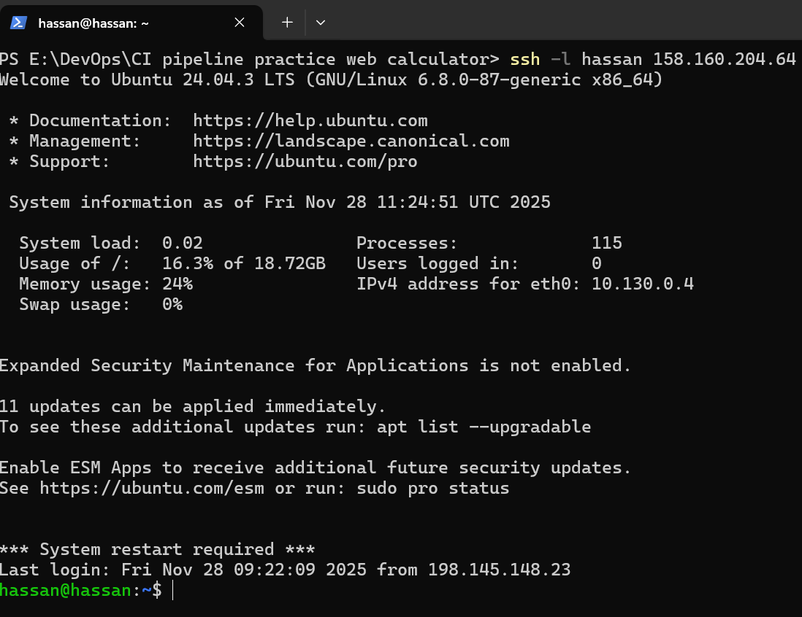
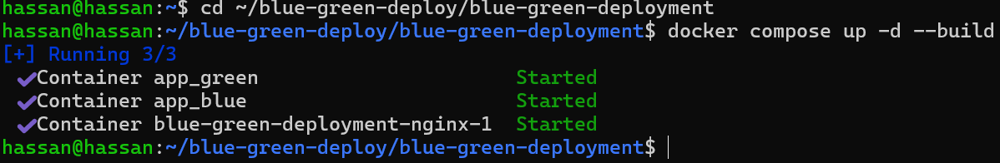
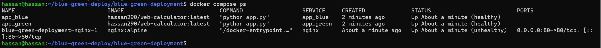
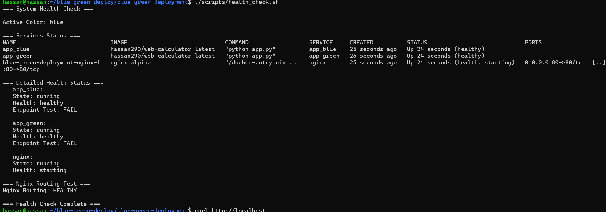
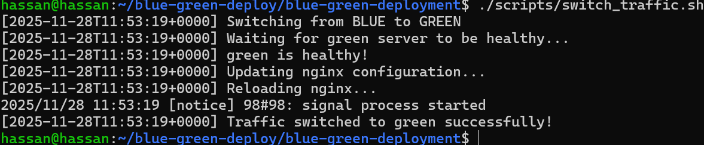
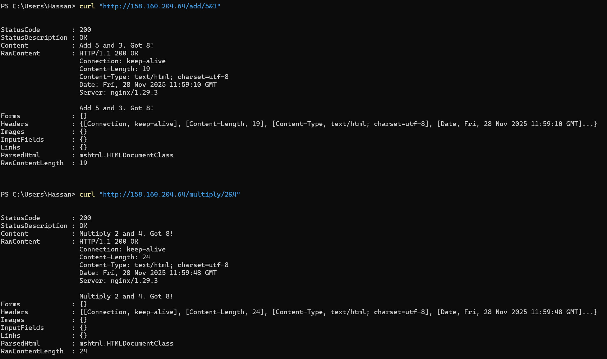

# CI/CD Pipeline Project

## Task 1: CI Pipeline - COMPLETED ✅

### Features Implemented:
- Unit Tests (pytest)
- Functional Tests (Selenium) 
- Docker Image Building
- Artifacts Storage
- Docker Hub Integration

### Proof of Completion:

**Results:**

**CI Pipeline:**

**Generated Artifacts:**

**Tests Results:**

## Task 2: CD Pipeline - Blue-Green Deployment ✅

### Features Implemented:

- Two application instances (blue + green)
- Nginx Reverse Proxy
- Health Checks
- Docker Compose infrastructure

### Proof of Completion:
**Yandex Cloud:**

**Connection with yandex cloud using ssh:**

**Connection Yandex:**

**Docker Container:**

**Docker Image:**

**Docker compose build:**

**Docker compose ps:**

**Health check:**

**Traffic switch:**

**Curl tests:**

### End